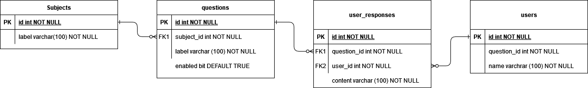

## Launch
To launch the backend simply run
```
$./gradlew bootRun
``` 

## Api Documentation
Survey API contains four API: 
Subject API, Question API, Survey API, User Response API

For details please refer to Swagger api documentation at:
```
http://${host}:${port}/swagger-ui.html
``` 
example
```
http://localhost:8080/swagger-ui.html
```

## Domain model



## Subject API Documentation

**Gel all subjects**
Returns subjects by ids with related to it questions:
```
Request:
curl --location --request GET 'http://localhost:8080/api/v1/subject/1,2,3'

Response:
[
    {
        "subjectId": 1,
        "subjectLabel": "Where does Santa Claus Live?",
        "questions": [
            {
                "questionId": 1,
                "questionLabel": "Hawaii?",
                "enabled": true
            },
            {
                "questionId": 2,
                "questionLabel": "Finland?",
                "enabled": true
            },
            {
                "questionId": 3,
                "questionLabel": "Sweden?",
                "enabled": true
            },
            {
                "questionId": 4,
                "questionLabel": "China?",
                "enabled": true
            }
        ]
    },
    {
        "subjectId": 2,
        "subjectLabel": "Where yo satisfied with your Christmas present?",
        "questions": [
            {
                "questionId": 5,
                "questionLabel": "Very satisfied",
                "enabled": true
            },
            {
                "questionId": 6,
                "questionLabel": "Somewhat satisfied",
                "enabled": true
            },
            {
                "questionId": 7,
                "questionLabel": "Never satisfied or dissatisfied",
                "enabled": true
            },
            {
                "questionId": 8,
                "questionLabel": "Dissatisfied",
                "enabled": true
            },
            {
                "questionId": 9,
                "questionLabel": "Very dissatisfied",
                "enabled": false
            }
        ]
    },
    {
        "subjectId": 3,
        "subjectLabel": "Where do you live?",
        "questions": []
    }
]
```

**Create a new subject** 
```
Request:
curl --location --request POST 'http://localhost:8080/api/v1/subject' \
--header 'Accept: application/json' \
--header 'Content-Type: application/json' \
--data-raw '{
    "subjectLabel": "Where do you live?"
}'

Response:
{
    "subjectId": 3,
    "subjectLabel": "Where do you live?",
    "questions": null
}
```

## Question API Documentation

**Create new questions for subjectId**
```
Request:
curl --location --request POST 'http://localhost:8080/api/v1/question/' \
--header 'Accept: application/json' \
--header 'Content-Type: application/json' \
--data-raw '{
    "subjectId": 3,
    "subjectQuestions": [
            {
                "questionLabel": "Germany",
                "enabled" : true
            },
            {
                "questionLabel": "Ukraine",
                "enabled": true
            }
    ]
}'

Response:
{
    "subjectId": 3,
    "subjectQuestions": [
        {
            "questionId": 10,
            "questionLabel": "Germany",
            "enabled": true
        },
        {
            "questionId": 11,
            "questionLabel": "Ukraine",
            "enabled": true
        }
    ]
}
```

**Update existing questions for subjectId**
```
Request:
curl --location --request PUT 'http://localhost:8080/api/v1/question/' \
--header 'Accept: application/json' \
--header 'Content-Type: application/json' \
--data-raw '{
    "subjectId": 3,
    "subjectQuestions": [
        {
            "questionId": 10,
            "questionLabel": "Germany!!",
            "enabled": true
        },
        {
            "questionId": 11,
            "questionLabel": "Ukraine!!",
            "enabled": true
        }
    ]
}'

Response:
{
    "subjectId": 3,
    "subjectQuestions": [
        {
            "questionId": 10,
            "questionLabel": "Germany!!",
            "enabled": true
        },
        {
            "questionId": 11,
            "questionLabel": "Ukraine!!",
            "enabled": true
        }
    ]
}
```

## User response API Documentation

**Create new user responses for userId**
```
Request:
curl --location --request POST 'http://localhost:8080/api/v1/response' \
--header 'Content-Type: application/json' \
--header 'Accept: application/json' \
--data-raw '{
    "userId": 1,
    "userResponses": [
        {
        "questionId": 10,
        "userResponse": "Yes"
        },
        {
        "questionId": 11,
        "userResponse": "Yes"
        }
    ]
}'

Response:
{
    "userId": 1,
    "responses": [
        {
            "userResponseId": 30,
            "questionId": 10,
            "userResponseOption": null,
            "userResponse": "Yes"
        },
        {
            "userResponseId": 31,
            "questionId": 11,
            "userResponseOption": null,
            "userResponse": "Yes"
        }
    ]
}
```

**Update existing user responses for userId**
```
Request:
curl --location --request PUT 'http://localhost:8080/api/v1/response' \
--header 'Content-Type: application/json' \
--header 'Accept: application/json' \
--data-raw '{
    "userId": 1,
    "userResponses": [
        {
        "questionId": 10,
        "userResponse": "No"
        },
        {
        "questionId": 11,
        "userResponse": "No"
        }
    ]
}'

Response:
{
    "userId": 1,
    "responses": [
        {
            "userResponseId": 30,
            "questionId": 10,
            "userResponseOption": "Germany!!",
            "userResponse": "No"
        },
        {
            "userResponseId": 31,
            "questionId": 11,
            "userResponseOption": "Ukraine!!",
            "userResponse": "No"
        }
    ]
}
```

## Survey API Documentation
API returns a list of subjects related to user responses to questions. Survey API returns only enabled questions. 
To disable/enable questions please use Question API update the question.

**Get surveys by subjectIds and userId**
```
Request:
curl --location --request GET 'http://localhost:8080/api/v1/survey/1,2,3/user/1'

Response:
{
    "userId": 1,
    "responses": [
        {
            "surveyId": 1,
            "surveyTitle": "Where does Santa Claus Live?",
            "questions": [
                {
                    "userResponseId": 21,
                    "questionId": 1,
                    "userResponseOption": "Hawaii?",
                    "userResponse": "No"
                },
                {
                    "userResponseId": 22,
                    "questionId": 2,
                    "userResponseOption": "Finland?",
                    "userResponse": "Yes"
                },
                {
                    "userResponseId": 23,
                    "questionId": 3,
                    "userResponseOption": "Sweden?",
                    "userResponse": "No"
                },
                {
                    "userResponseId": 24,
                    "questionId": 4,
                    "userResponseOption": "China?",
                    "userResponse": "No"
                }
            ]
        },
        {
            "surveyId": 2,
            "surveyTitle": "Where yo satisfied with your Christmas present?",
            "questions": [
                {
                    "userResponseId": 25,
                    "questionId": 5,
                    "userResponseOption": "Very satisfied",
                    "userResponse": "No"
                },
                {
                    "userResponseId": 26,
                    "questionId": 6,
                    "userResponseOption": "Somewhat satisfied",
                    "userResponse": "Yes"
                },
                {
                    "userResponseId": 27,
                    "questionId": 7,
                    "userResponseOption": "Never satisfied or dissatisfied",
                    "userResponse": "No"
                },
                {
                    "userResponseId": 28,
                    "questionId": 8,
                    "userResponseOption": "Dissatisfied",
                    "userResponse": "No"
                }
            ]
        }
    ]
}
```

**Get all surveys for userId**
```
Request:
curl --location --request GET 'http://localhost:8080/api/v1/survey/all/user/1'

Response:
{
    "userId": 1,
    "responses": [
        {
            "surveyId": 1,
            "surveyTitle": "Where does Santa Claus Live?",
            "questions": [
                {
                    "userResponseId": 21,
                    "questionId": 1,
                    "userResponseOption": "Hawaii?",
                    "userResponse": "No"
                },
                {
                    "userResponseId": 22,
                    "questionId": 2,
                    "userResponseOption": "Finland?",
                    "userResponse": "Yes"
                },
                {
                    "userResponseId": 23,
                    "questionId": 3,
                    "userResponseOption": "Sweden?",
                    "userResponse": "No"
                },
                {
                    "userResponseId": 24,
                    "questionId": 4,
                    "userResponseOption": "China?",
                    "userResponse": "No"
                }
            ]
        },
        {
            "surveyId": 2,
            "surveyTitle": "Where yo satisfied with your Christmas present?",
            "questions": [
                {
                    "userResponseId": 25,
                    "questionId": 5,
                    "userResponseOption": "Very satisfied",
                    "userResponse": "No"
                },
                {
                    "userResponseId": 26,
                    "questionId": 6,
                    "userResponseOption": "Somewhat satisfied",
                    "userResponse": "Yes"
                },
                {
                    "userResponseId": 27,
                    "questionId": 7,
                    "userResponseOption": "Never satisfied or dissatisfied",
                    "userResponse": "No"
                },
                {
                    "userResponseId": 28,
                    "questionId": 8,
                    "userResponseOption": "Dissatisfied",
                    "userResponse": "No"
                }
            ]
        }
    ]
}
```